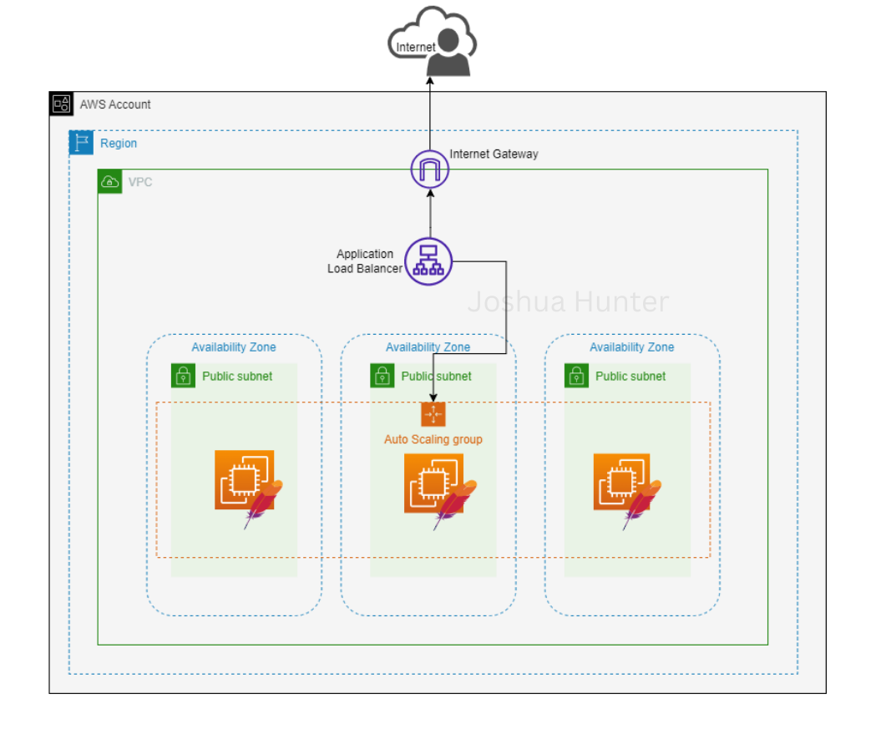
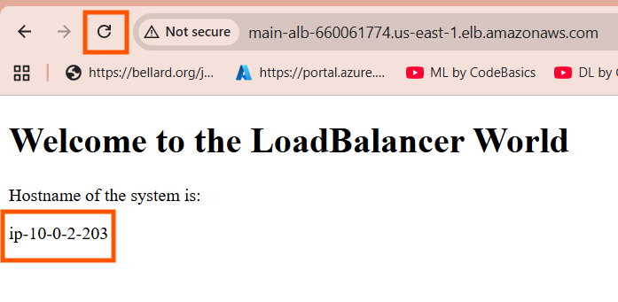
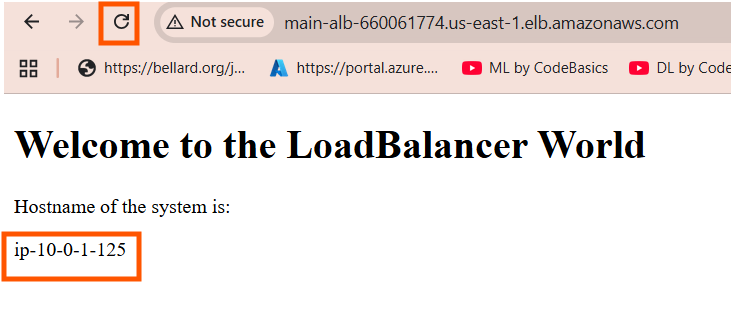

# 🚀 AWS Multi-AZ Web Server Stack using Terraform

This project provisions a highly available web server infrastructure on AWS using Terraform. It sets up a multi-AZ deployment with the following components:

we can see how traffic is routing to different servers

 

## Services List

- 🟢 **Auto Scaling Group (ASG)**
- 🟣 **Application Load Balancer (ALB)**
- 🔐 **Security Groups (SG)**
- 🌐 **Internet Gateway (IGW)**
- 🖥️ **EC2 Instances with Apache HTTP Server**
- 🧭 **Accessible via Chrome/Browser**
- 🏞️ **Multi-AZ setup for high availability**

---

## 📁 Project Structure

* terraform-aws-web-stack/
  * main.tf # Main Terraform configuration
  * variables.tf # Input variables
  * outputs.tf # Outputs such as ALB DNS
  * userdata.sh # Apache installation script
  * terraform.tfvars # Variable values
  * README.md # Project documentation

---

## 📦 What This Stack Does

- Creates a **VPC** with public subnets across **multiple availability zones**
- Configures an **Internet Gateway** for public access
- Provisions **Security Groups** to allow HTTP traffic
- Launches an **Application Load Balancer** (ALB)
- Creates an **Auto Scaling Group (ASG)** to manage EC2 instances
- Installs **Apache HTTP Server** on each EC2 instance using user data
- Automatically balances traffic between AZs
- Provides a public **ALB DNS endpoint** to access the web app

---

## 🧰 Prerequisites

- Terraform
- AWS CLI configured
- AWS credentials with appropriate permissions
- An existing SSH key pair in your AWS account (optional)

---

🔄 Auto Scaling & High Availability

   * The ASG launches EC2 instances in multiple AZs.
   * The ALB balances incoming traffic across these instances.
   * If an instance fails, ASG automatically replaces it.

