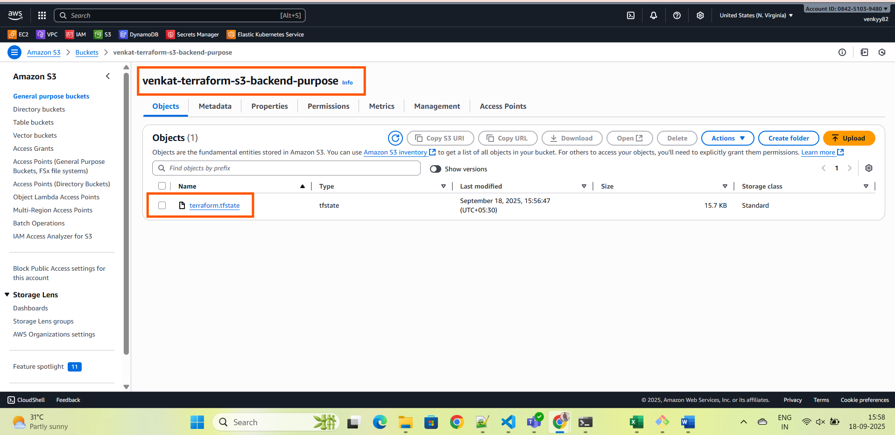
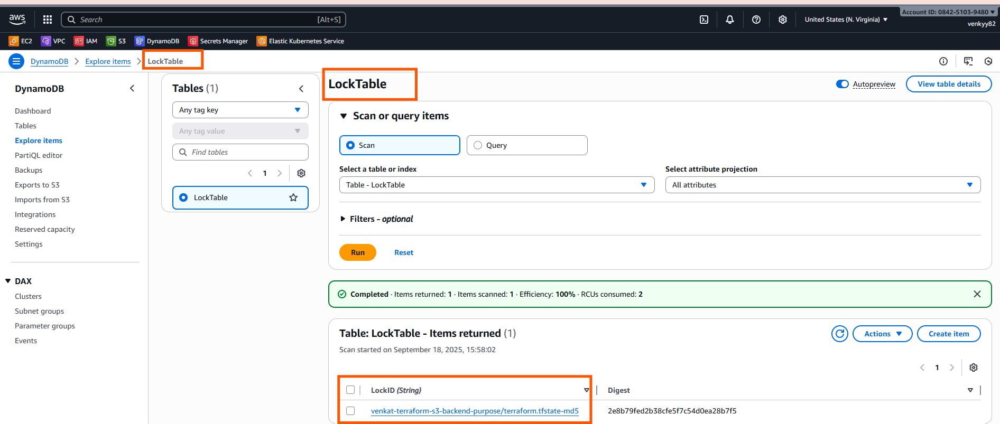
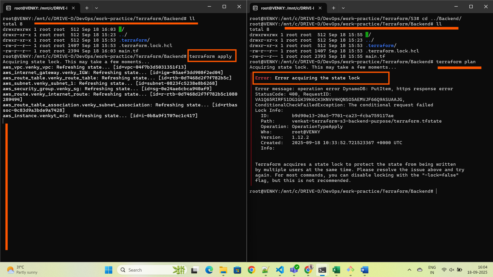

# 🚀 Terraform Project: AWS Infrastructure with S3 Backend and DynamoDB Locking

This project demonstrates how to:

- Create a secure and versioned **Terraform remote backend** using:
  - **S3** bucket for storing Terraform state
  - **DynamoDB** for state locking and consistency
- Provision basic **AWS infrastructure**:
  - VPC, Subnet, Internet Gateway, Route Table
  - Security Group
  - EC2 Instance
- Observe **real-time Terraform state locking**

---

## 📁 Project Structure

* Terraform/
    * backend/  # Contains backend config using S3 and DynamoDB
    * dynamodb/ # Code to create DynamoDB table for state locking
    * s3/       # Code to create S3 bucket for storing state
    * Infrastructure definition (EC2, VPC, etc.)

---

## ✅ Prerequisites

- AWS CLI configured (`aws configure`)
- Terraform installed 
- IAM user with access to:
  - S3
  - DynamoDB
  - EC2
  - VPC

---

## 🔧 Step-by-Step Setup

### 1. Create S3 Bucket for State
### 2. Create DynamoDB for state Locking
### 3. Create the infra Resources 

#### s3 Bucket creation

#### DynamoDB creation

> we can check the state locking how it works.

> if multiple user try to work on same time it wont allow.

## Happy Learning

