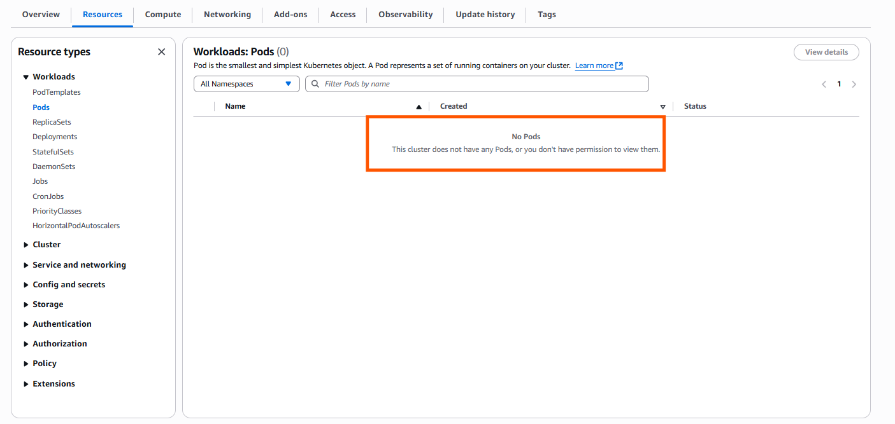
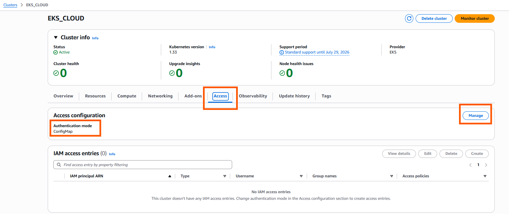
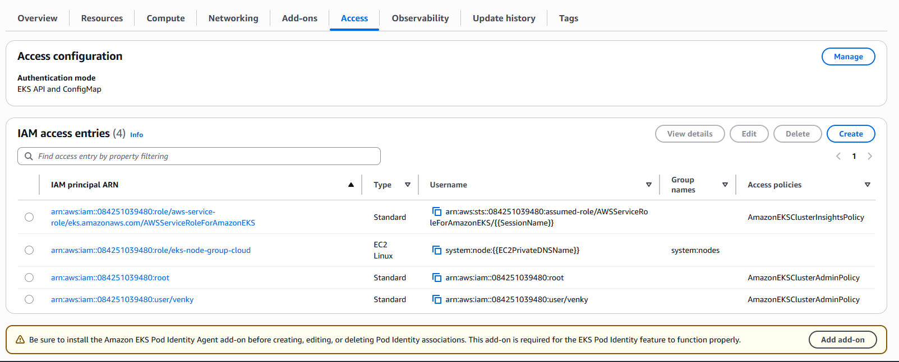
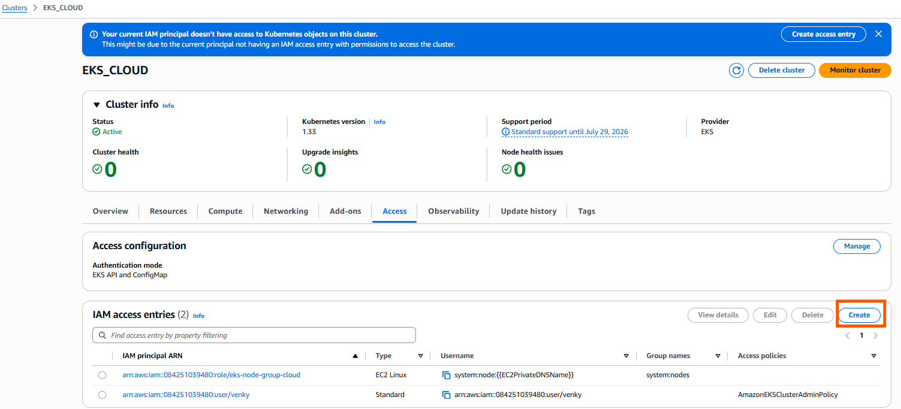
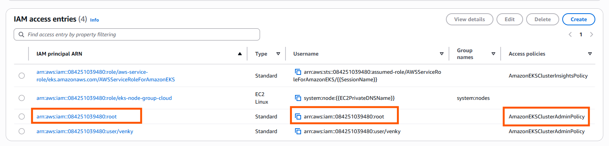
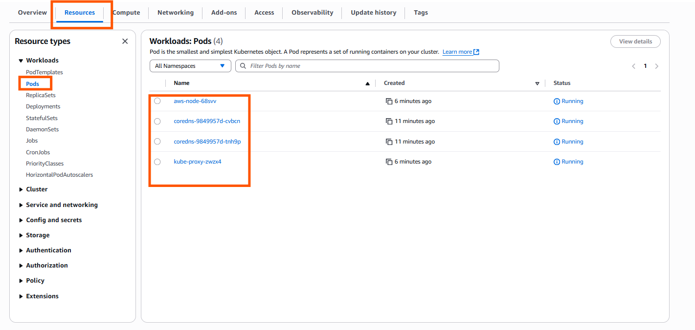

# Steps to access the EKS Cluster after creation:

## Step-1:

After creation of EKS Cluster try to access the cluster resources from resources Tab, if you are not getting may be Your current IAM principal doesn't have access to Kubernetes objects on this cluster.



## Step-2:

check your Access Configuration under access Tab inside the cluster.
if Authentication mode shows EKS API only try to chnage it to EKS API and config





## Step-3:

Make sure your IAM role or IAM user is added to the aws-auth ConfigMap in EKS. This is where EKS defines which IAM identities have access to the Kubernetes API server.



## Step-4:

under IAM Access Entries edit and attach to user and provide the required permissions like EKSCLusterAdminPolicy so that we will get access to accessing the objects in cluster



## Step-5:

finally we can try to access the objects in the cluster



## Step-6:

After setting up everything we can run below commands and we can play with it.

```
aws eks update-kubeconfi --name <clustername> --region <regionname>
aws configure
kubectl get nodes
```


## Thank you For Having Great Learning


