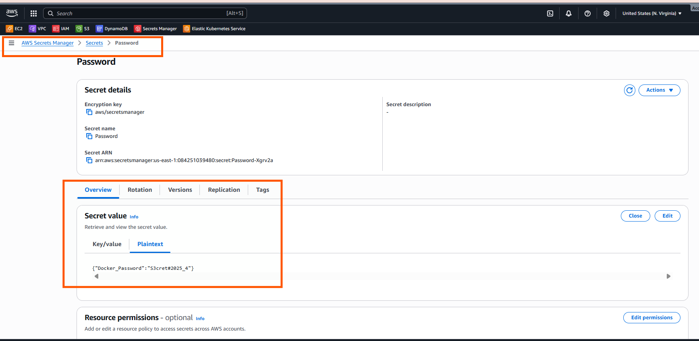
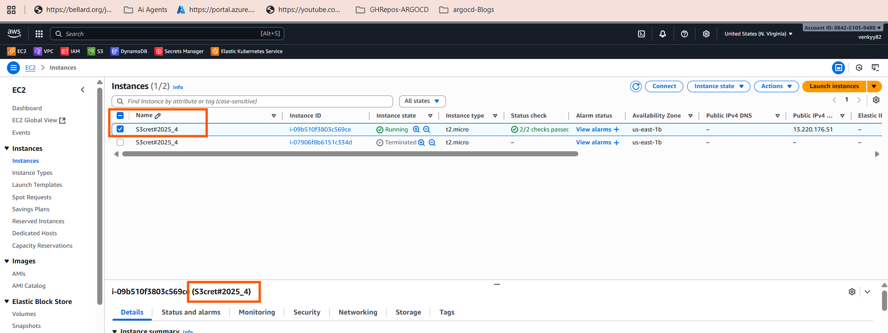

# Note:

# This is just a demonstration of how to fetch and use secrets from AWS Secrets Manager using Terraform — not intended for real-world use CASE.

## 🚀 EC2 Instance Deployment with AWS Secrets Manager using Terraform

This Terraform configuration deploys an EC2 instance in AWS and dynamically fetches a secret (`Docker_Password`) from AWS Secrets Manager. The fetched secret is used to tag the EC2 instance — demonstrating how to securely retrieve and use secrets in infrastructure automation.

---

## 🔧 What This Does

- Fetches a secret named **`Password`** from AWS Secrets Manager.
- Extracts the `Docker_Password` value from the secret (expects JSON format).
- Launches an EC2 instance:

- Tags the EC2 instance with the secret value as its `Name`.

---


## 📋 Prerequisites


* AWS Secret named `Password` created with the following format:

```json
{
  "Docker_Password": "S3cret#2025_4"
}
```

You can create this using AWS CLI:

```bash
aws secretsmanager create-secret \
  --name Password \
  --secret-string '{"Docker_Password":"S3cret#2025_4"}' \
  --region us-east-1
```


---

## 🔐 Important Notes

* The EC2 instance tag will be: `Name = S3cret#2025_4` (or whatever value is in your secret).
* Ensure your IAM permissions allow:

  * Reading from Secrets Manager
  * Launching EC2 instances
  * Using the specified subnet, security group, and key pair

---

## 🚨 Security Warning

Do **not** expose real secrets in public GitHub repos. This project is for demonstration purposes — ensure you manage secrets and access securely in real deployments.

---

## ✅ Example Output (in AWS Console)

After apply, you can verify:

* The EC2 instance is running
* It has a tag `Name = S3cret#2025_4`



