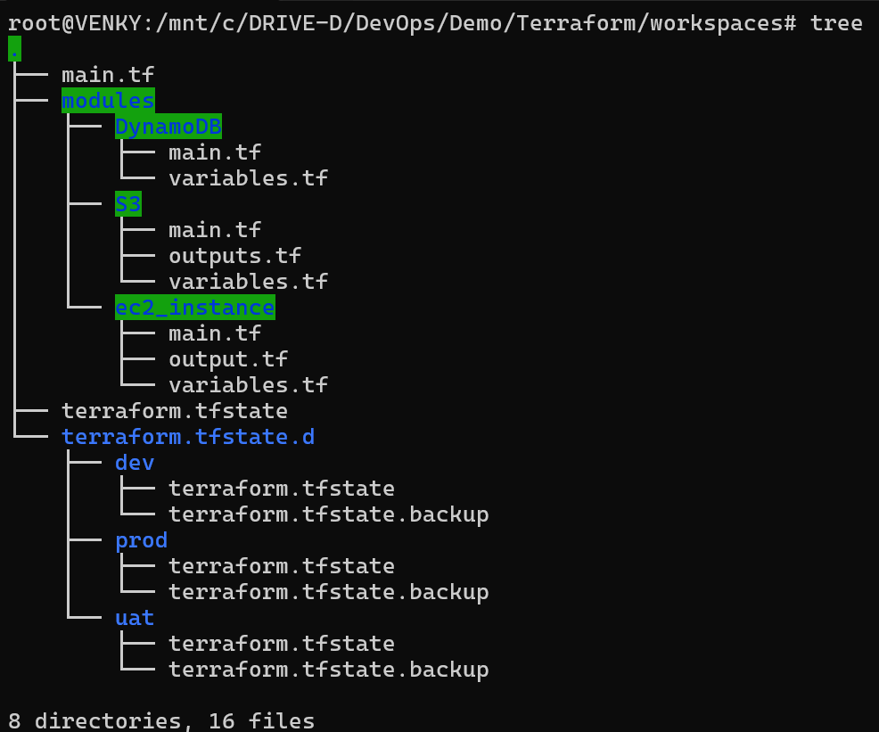
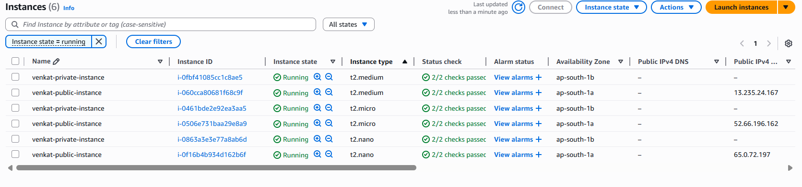

# 🌐 Terraform Modules and Workspaces
* This project demonstrates a scalable and modular approach to manage infrastructure as code using Terraform. It leverages:

  * Reusable modules to define infrastructure components (e.g., EC2, S3, DynamoDB) in a DRY (Don't Repeat Yourself) manner.
  * Terraform workspaces to manage multiple environments (e.g., dev, uat, prod) from the same configuration without duplicating code.

* By combining modules and workspaces, this structure supports:
  * Consistent infrastructure across environments
  * Easy environment isolation
  * Cleaner and more maintainable Terraform codebase

📤 Terraform Outputs

This project uses output blocks to expose key information (e.g., instance IPs, resource names) after provisioning. These outputs can be used for automation, debugging, or as inputs to other modules or systems

## we can see the directory Structure 

state file will update based on the workspace where ever we are working. if we did not choose any workspace it will update under default state file.

###### we can see the ec2 instances running even after chnaging the instance type existing instances are still in running state because of workspace approach.

