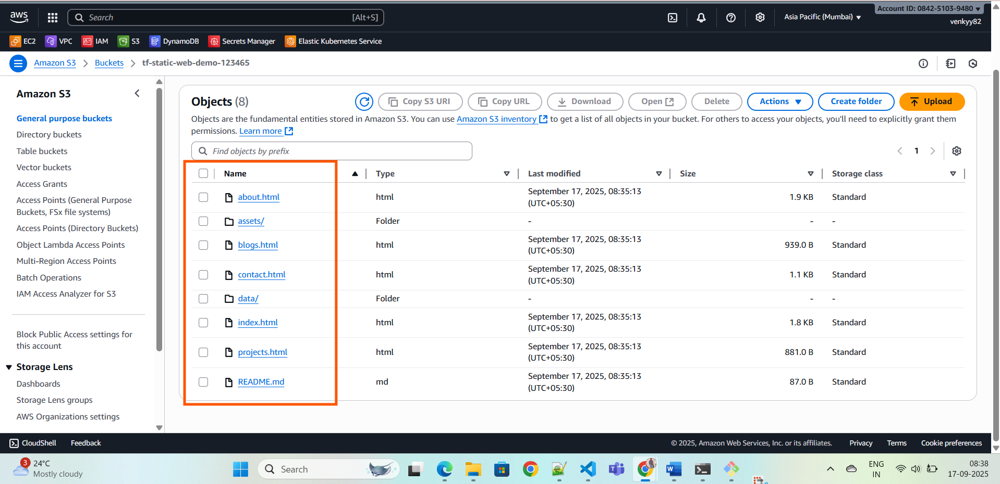
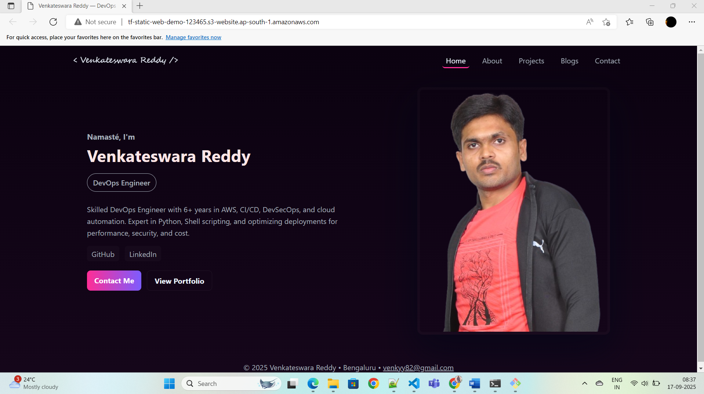

# Terraform AWS S3 Static Website - Portfolio Deployment

This Terraform configuration deploys a **static website** on **AWS S3** and uploads an entire `Portfolio` folder. It creates an S3 bucket, enables website hosting, sets a public access policy, and uploads all files recursively from the `Portfolio` folder.

---

## Features

- Creates an **S3 bucket** for static website hosting
- Configures **index and error documents**
- Disables public access blocks for public website access
- Attaches a **public read policy**
- Uploads `index.html` and all files in the `Portfolio` folder recursively
- Outputs the **website URL**

---

## Prerequisites

- [Terraform](https://www.terraform.io/downloads) >= 1.2.0
- AWS account with S3 permissions
- AWS CLI configured with proper credentials

---

> Terraform will upload all files inside the `Portfolio` folder recursively. we can see the directory structure after deploying in s3.




---

## Usage

1. Clone the repository:

```bash
git clone <your-repo-url>
cd <repo-directory>
```
2.Ensure the Portfolio folder contains your website files, including index.html.

3.Initialize Terraform:
```
terraform init
```
4.Plan the deployment:
```
terraform plan
```
5.Apply the configuration:
```
terraform apply
```
6.After a successful apply, Terraform will output the website URL:
```
Website URL: http://<bucket-name>.s3-website.<region>.amazonaws.com
```

we can see the final outcome in outside the world.




