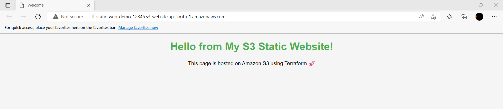

# Terraform AWS S3 Static Website

This Terraform configuration deploys a **static website** on **AWS S3**. It creates an S3 bucket, enables website hosting, sets a public access policy, and uploads an `index.html` file.

---

## Features

- Creates an **S3 bucket** for static website hosting
- Configures **index and error documents**
- Makes the bucket **public** for website access
- Uploads `index.html` from the local module
- Outputs the **website URL**

---

## Prerequisites

- Terraform installation
- AWS account with permissions to create S3 buckets
- AWS CLI configured with proper credentials

---

## Usage

1. Clone the repository:

```bash
git clone <your-repo-url>
cd <repo-directory>
```
2.Create an index.html file in the same directory as the Terraform files (or use the provided one).
3.Initialize Terraform:
```
terraform init
```
4.Plan the deployment:
```
terraform plan
```
5.Apply the configuration:
```
terraform apply
```
6.After a successful apply, Terraform will output the website URL:
```
Website URL: http://<bucket-name>.s3-website.<region>.amazonaws.com
```

we can finally see the website accessing from outside the world

